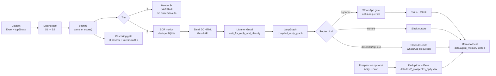

# Addi GTM Technical Challenge

[](https://github.com/cataia-code/addi-gtm-technical-challenge/actions/workflows/ci.yml)

Proyecto GTM con scoring validado, agentes LangGraph, demos reales controladas y memoria local en SQLite dentro de `data/`.

## Motion completa



Score Tier B:

- `fit_score`: percentiles de GMV, clientes y cercania al ticket objetivo COP 275k.
- `momentum_score`: crecimiento 90d anualizado, capeado en 200%.
- `recency_score`: decaimiento exponencial por dias desde ultima originacion.
- `category_bonus`: premio por categorias con baja penetracion Marketplace.
- `final_score`: `0.55 fit + 0.25 momentum + 0.05 recency + category_bonus`.

## Arquitectura

```text
analysis/
  top50.csv                         Ranking oficial versionado
  validation_report.md              Resumen de validacion en espanol
data/
  GTM-Engineer-BC-Dataset.xlsx      Dataset fuente preservado
  agent_memory.sqlite3              Runtime local ignorado por git
  test2_prospectos_apify.xlsx       Export de prospeccion
live_demo/
  test1_e2e_real.py                 Gmail -> listener -> LangGraph -> WhatsApp/Slack
  test2_prospeccion_apify_gate.py   Apify/Groq -> LangGraph -> Excel
  email_listener.py                 Listener Gmail que invoca compiled_reply_graph
notebooks/
  01_diagnostico_seleccion_s1s2.ipynb
  02_scoring_model.ipynb
  04_qualification_llm_eval.ipynb
  05_agente_langgraph_demo.ipynb
  06_demo_e2e_langgraph_real.ipynb
  07_demo_prospeccion_langgraph_excel.ipynb
src/
  agents/                           Grafos y nodos LangGraph
  db/                               SQLite, memoria y repositorio
  enrichment/                       Apify/Apollo y perfiles LLM
  handoff/                          Slack Block Kit
  outreach/                         Gmail y Twilio WhatsApp
  qualification/                    Prompt y clasificador Groq
  scoring/                          Score, constantes y validators
tests/
  test_scoring_integrity.py          Gate CI de los 8 asserts
```

## Notebooks

Ejecutar desde la raiz del repo:

```bash
jupyter notebook
```

- `01_diagnostico_seleccion_s1s2.ipynb`: diagnostico con DuckDB, graficos y conclusion S1 -> S2.
- `02_scoring_model.ipynb`: importa `src.scoring.compute_score.calcular_score`, muestra formula, sensibilidad y asserts.
- `04_qualification_llm_eval.ipynb`: evaluacion real del clasificador con Groq. Requiere `GROQ_API_KEY`.
- `05_agente_langgraph_demo.ipynb`: demo de rutas LangGraph con filas reales.
- `06_demo_e2e_langgraph_real.ipynb`: motion completa: score, imputar email/WhatsApp, grafo legible, email real, listener, WhatsApp y Slack.
- `07_demo_prospeccion_langgraph_excel.ipynb`: prospeccion por categoria/cantidad, deduplicacion y Excel.

## Tests reales

Los dos tests reales usan agentes LangGraph.

### Test 1: E2E outreach real

```bash
python live_demo/test1_e2e_real.py
```

Flujo real:

1. Lee `analysis/top50.csv`.
2. Selecciona `DEMO_BRAND_ID` si existe; si no, toma el mejor Tier B.
3. Imputa `DEMO_EMAIL_DESTINO` y `DEMO_WHATSAPP_NUMBER`.
4. Envia email HTML real por Gmail.
5. `email_listener.py` espera el reply.
6. El listener invoca `compiled_reply_graph.invoke(state)`.
7. LangGraph clasifica con Groq, enruta, aplica opt-in/opt-out, envia WhatsApp si corresponde y postea Slack.

Real: Gmail, Groq, Twilio WhatsApp, Slack.  
Simulado: nada, salvo que `dry_run=True` se pase manualmente en llamadas internas.

### Test 2: prospeccion real a Excel

```bash
python live_demo/test2_prospeccion_apify_gate.py --confirm-run --max-results 3
```

Flujo real:

1. Muestra el input de Apify antes de ejecutar.
2. Invoca `compiled_prospecting_graph.invoke(...)`.
3. LangGraph llama Apify, valida campos completos, deduplica contra SQLite, genera perfil/borrador con Groq y exporta Excel.
4. Registra memoria local en `data/agent_memory.sqlite3`.

Real: Apify y Groq.  
Simulado/no permitido: Slack, email y WhatsApp. Este script no importa servicios de envio.

## Tests y cobertura

```bash
pytest tests/ -v
coverage run --source=src -m pytest tests/
coverage report -m
```

El gate mas importante es:

```bash
pytest tests/test_scoring_integrity.py -v
```

Ese test recalcula el score y falla si se rompe cualquiera de los 8 checks validados: duplicados, categorias excluidas, Tier A exacto, correlaciones, cap de categoria, GMV contra dataset y tolerancia contra `analysis/top50.csv`.

## Variables locales

Las credenciales viven solo en `.env`, que esta ignorado por git. Variables usadas:

```text
GROQ_API_KEY
SLACK_WEBHOOK_URL
DEMO_EMAIL_DESTINO
DEMO_WHATSAPP_NUMBER
TWILIO_ACCOUNT_SID
TWILIO_AUTH_TOKEN
TWILIO_WHATSAPP_FROM
TWILIO_CONTENT_SID
GOOGLE_CLIENT_ID
GOOGLE_CLIENT_SECRET
APIFY_API_TOKEN
```

No subir `.env`, `credentials.json`, `token.json` ni bases SQLite.
